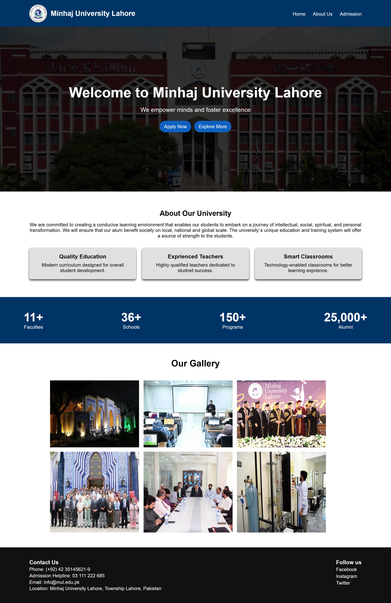
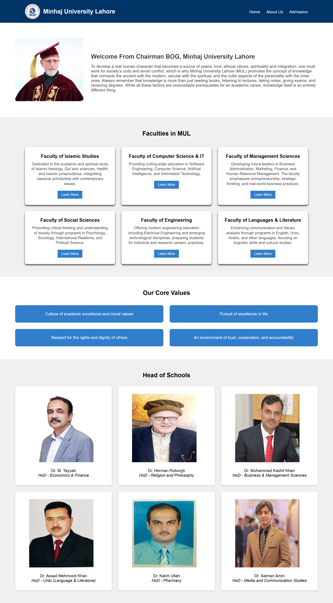
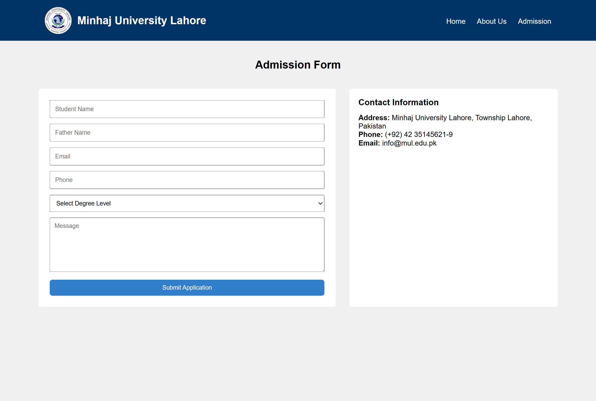

# 🎓 Minhaj University Website

A modern **Minhaj University Lahore Website** built using **HTML5** and **CSS3**. This project showcases a university website featuring a homepage, admission page, faculty information, university statistics, gallery, contact section, and an admission form. It was developed to strengthen frontend development skills by practicing multi-page website design and layout structuring.

## ✨ Features

- 🎓 Professional university website design
- 🧭 Navigation bar with multiple pages
- 🏫 Hero section with call-to-action buttons
- ℹ️ About University section
- 👨‍🏫 Faculty and department showcase
- 📊 University statistics section
- 🖼️ Image gallery
- 📝 Admission form page
- 📞 Contact information section
- 👥 Head of Schools showcase
- 🎨 Clean and organized layout
- 💻 Built with semantic HTML5 and CSS3
- 🌐 Cross-browser compatible

## 🛠️ Technologies Used

- HTML5
- CSS3

## 📸 Preview

## Home Page

## About Section

## Contact Section

## 🚀 Live Demo

🌐 **Live Website:** https://maziaramzan80.github.io/HTML-CSS-University-Website-Project/

## 📚 What I Learned

Through this project, I improved my understanding of:

- Semantic HTML5 structure
- Multi-page website development
- CSS Flexbox
- CSS Grid
- Navigation bar design
- Hero section layout
- Card-based UI design
- Form design and styling
- Image gallery layouts
- Typography and spacing
- Website layout organization
- Professional educational website design

## 👩‍💻 Author

**Mazia Ramzan**  
**Frontend Web Developer**

- GitHub: https://github.com/maziaramzan80
- LinkedIn: https://www.linkedin.com/in/mazia-ramzan-8aa7b4342?utm_source=share_via&utm_content=profile&utm_medium=member_android
- Instagram: https://www.instagram.com/web_canvas_?igsh=eXppZ2FjbWsweDlo

## ⭐ Support

If you found this project helpful or inspiring, please consider giving it a **⭐ Star** on GitHub. Your support motivates me to continue building more frontend development projects.
